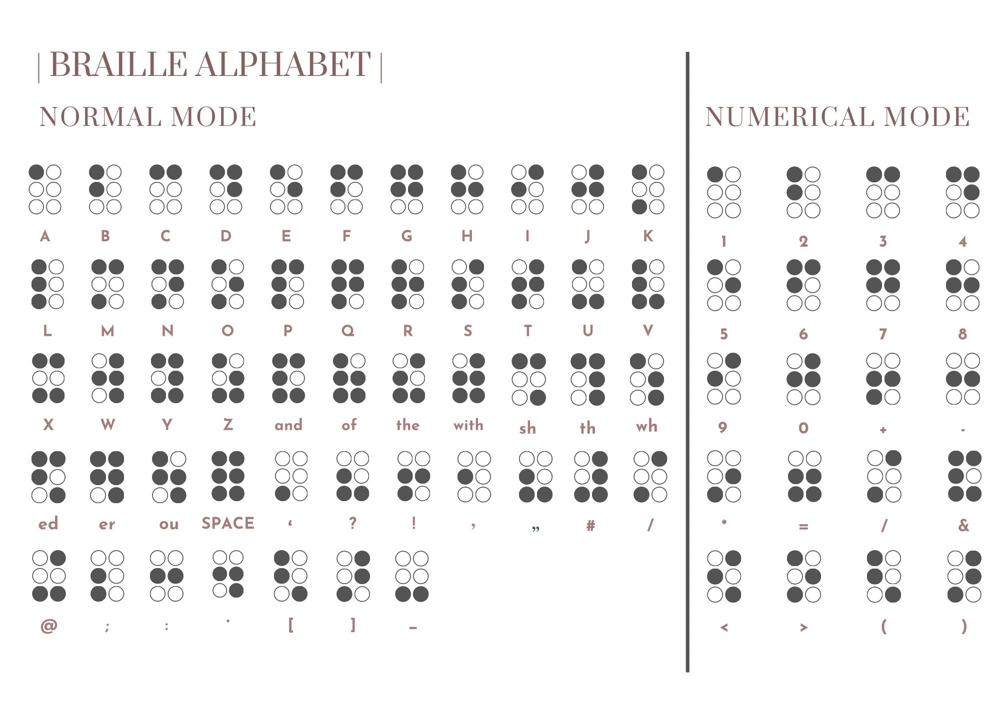
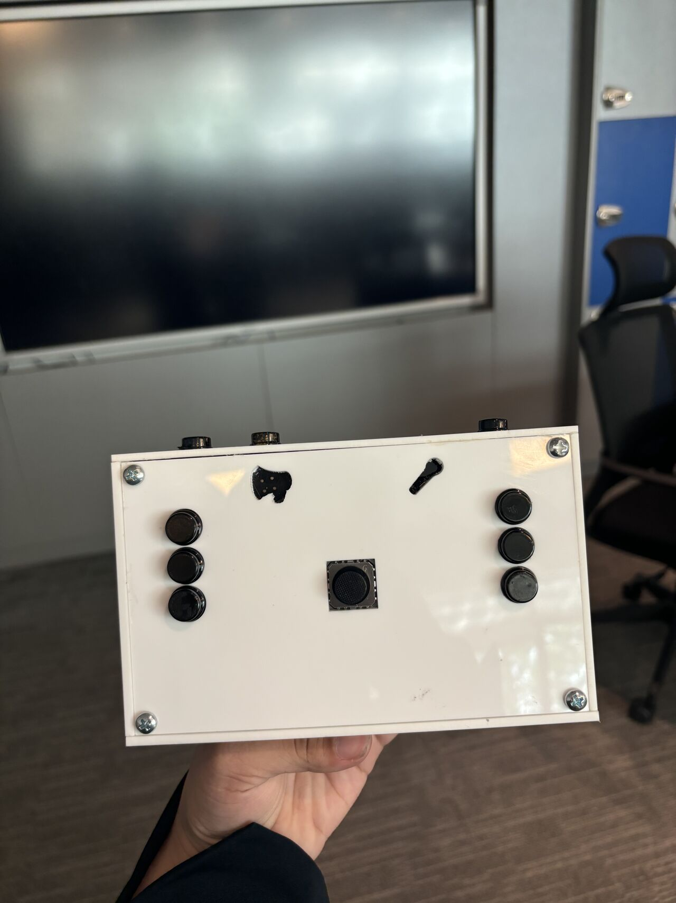

## Bluetooth-based Braille Keyboard: Empowering Communication for the Visually Impaired
This project was completed as part of my senior project at the University of Bahrain, in collaboration with my partner Sadeen Mustafa. The device was designed to empower individuals with visual impairments by providing an alternative and flexible input system for smart devices. The main goal was to create a more accessible way for visually impaired users to interact with their devices, offering features such as Braille input, speech-to-text conversion, and Bluetooth connectivity.

## Overview
The Bluetooth-based Braille Keyboard provides an intuitive and accessible method for users with visual impairments to interact with smartphones, computers, and other Bluetooth-enabled devices. The system supports multiple operational modes, integrates speech-to-text functionality, and provides audio feedback to confirm actions. By combining Braille input with modern technologies like Bluetooth and speech recognition, this device aims to bridge communication gaps for the visually impaired community.

## Key Features
1- Bluetooth Connectivity: Easy to connect to a wide range of smart devices, ensuring portability and flexibility.

2- Braille Input: The keyboard features six Braille keys for typing along with additional keys for "backspace" and "new line." It supports two operational modes:

  a- Normal Mode: For typing letters, punctuation, and common words.
  b- Numerical Mode: For inputting numbers and mathematical symbols.

3- Speech-to-Text Integration: A dedicated button allows users to record and transcribe their voice into text. Audio feedback confirms success or indicates errors, ensuring a smooth user experience.

4- Joystick Navigation: The built-in joystick enables easy navigation using arrow-based movement for tasks like scrolling or selecting options.

5- Audio Feedback: Each action (e.g., typing, mode switching, or navigation) is confirmed with audio feedback, ensuring seamless interaction for users with visual impairments.

## Technologies Used
Microcontroller: The project uses a microcontroller (such as the ESP32) to handle Bluetooth communication and input processing.
Bluetooth Low Energy (BLE): For communication between the Braille keyboard and paired smart devices.
Speech-to-Text APIs: Integration with speech recognition APIs to convert spoken words into text.
Audio Feedback: An audio system to provide feedback to the user.

## Demo 
https://youtu.be/isuPdgXAj5E 

## Photos
The Circuit:

Final implementation 

Braille Figure

